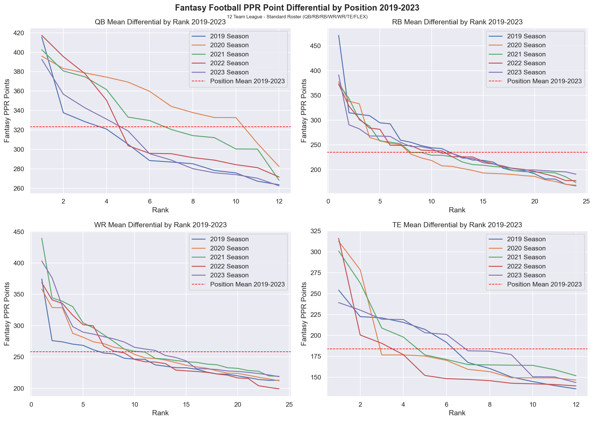
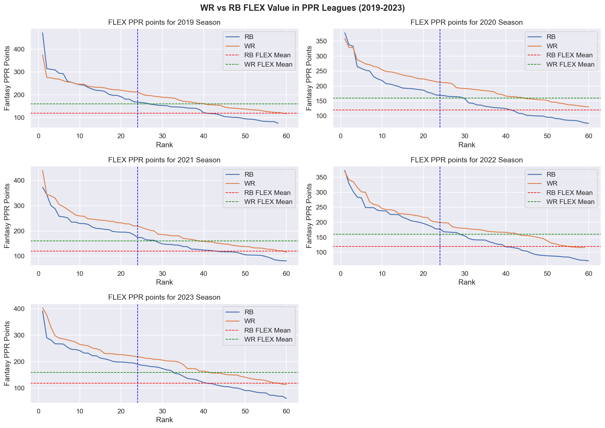
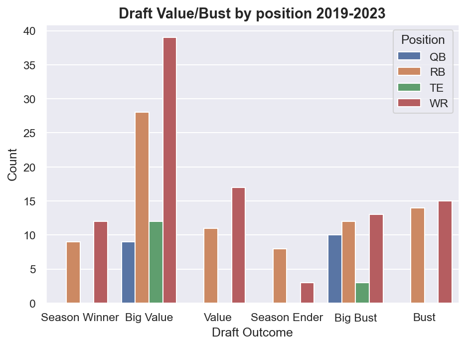
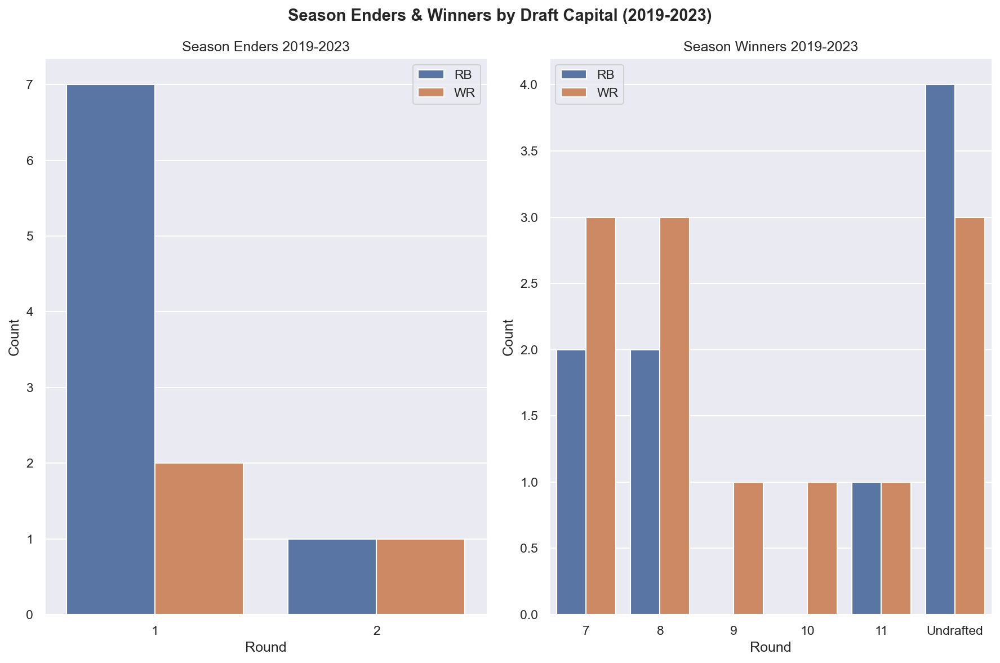
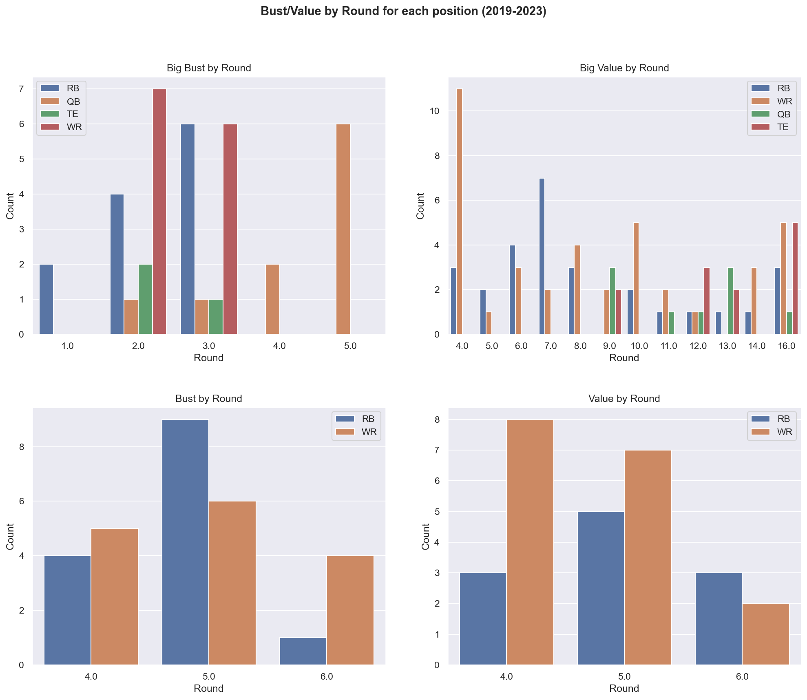
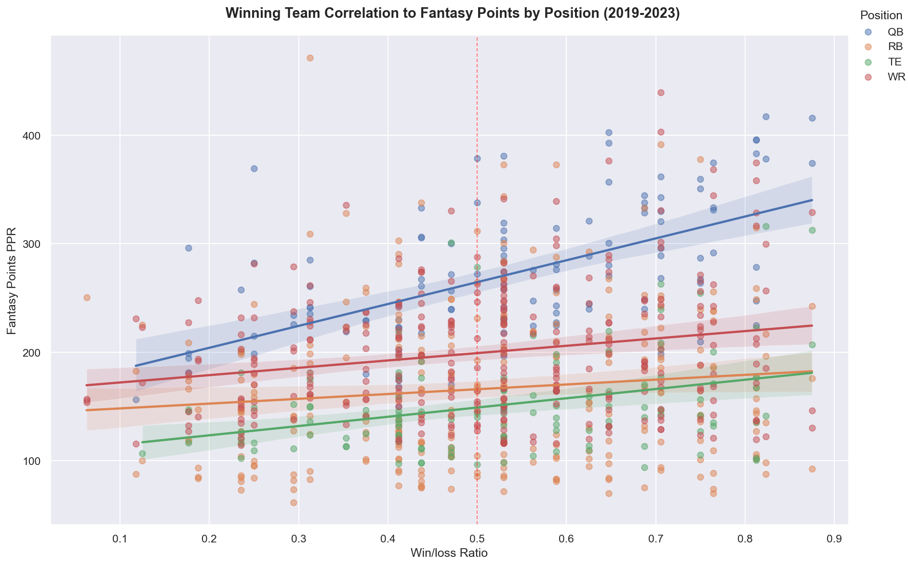

# Fantasy Football Draft Intelligence: A 5 Year PPR Analysis


## Table of Contents
- [Overview](#overview)
- [Key Findings](#key-findings)
- [Visualizations](#visualizations)
- [Draft Outcome Player Tables](#draft-outcome-player-tables)
- [Data Sources](#data-sources)
- [Data Limitations](#data-limitations)
- [Methodology](#methodology)
- [Setup & Installation](#setup--installation)
- [Technologies Used](#technologies-used)
- [Roadmap](#roadmap)

## Overview

Fantasy football drafts are won and lost on research, the goal of this project is to turn five years of fantasy data into actionable insights you can use on your draft strategy. 

The data used for this project covers information from the 2019-2023 NFL seasons and was extracted from nflreadpy, a Python package that lets you extract information from the nflverse repositories.

This analysis lets you gain an edge by giving insights or answering the following questions:
- At what round does production drop off at each position?
- When is it worthwhile to reach for the top players of a position (QB/TE)?
- Which rounds provide the most value and highest bust risk?
- Which positions should be prioritized in early vs late round?
- Are there rounds where a specific position has had higher potential for values?
- How does an NFL team's win/loss ratio affect fantasy production for different positions?

By understanding these patterns you will be able to make data driven decisions on draft day that can make the difference when it comes to winning your fantasy football league.

## Key Findings

- Understanding the QB position is instrumental to building a solid fantasy team. This position is the most highly 
correlated with an NFL team's win/loss ratio, and it's the position with the most consistent production among starting players. 
This indicates that the best recipe for selecting a QB is waiting for the later rounds and choosing QBs in efficient offenses,
or offenses with high potential (young players, changes to GM or head coach).


- Having an elite QB/TE is an incredible boost for any fantasy team, but given the draft capital required to get them
and the subtle drop off / high amount of sleepers at later rounds at both positions, it's almost never worth the cost.


- A top 5 RB is one of the most valuable assets in a fantasy team, given our win/loss correlation analysis we can determine
that the difference between a top 12 RB and a top 5 RB is a NFL team with a strong offense and touchdown opportunities. 
Regardless of individual player talent, a RB needs touchdown opportunities to break the top 5 threshold. 


- For PPR leagues, the FLEX spot should almost always be a WR, the average difference between the RB and WR position in 
these ranges is approximately 35 ppr points per season, which could be weekly winning upside.


- The WR position provides the highest value opportunity. Many of the RB values in our data-set exist because
of the injury prone nature of the RB position. WR values tend to emerge from a breakout season, more opportunities resulting
from a strong offense, or good chemistry with the QB. Making this value more predictable and reliable.


- Round 7-8 are the pot of gold for season winners, with a total of ten players (RB and WR) drafted in these rounds that
had season winning upside.


- The riskiest rounds for drafting WRs is surprisingly round 2 and 3, with a total of 13 players that were categorized 
as big busts in these ranges. Also, surprisingly round 4 is the round with the highest occurrence of big values at the position.


- Season enders are a phenomenon almost exclusive to round 1 and 2, most of these are caused by injury. The most important
factors to consider when drafting in these rounds is to stray from older players, players who are changing teams or have 
a huge change in their offensive ecosystem(rookie QB, new Head Coach) and most importantly, injury prone players. 


- Regarding injury prone players, it is important to mention players like Christian McCaffrey are boom or bust, he was 
tagged as a season ender in 3 seasons, but on his only fully healthy season he was nearly 155 points over the second ranked RB.
This kind of advantage on a single player is season winning upside.


- The WR position is the one least affected by an NFL team's win/loss ratio. Garbage time and catch up game plans help offset
lack of points and touchdowns in inefficient offenses.
## Visualizations

### PPR Point Differential by Position (2019-2023)

Season long PPR point totals for the top 12 QB/TE and top 24 RB/WR (starters for each position) plotted against their 
positional rank across five seasons (2019-2023). The red dashed line marks the positional mean among starters.

The steep dropoff at the RB and WR position after the first three players reinforces how valuable having one 
of the top three at either position can be. While the much flatter curve at the QB position clearly states that if you
can't get a good value for one of the top players, it's always better to wait when picking QB.



### Flex Analysis By Season

These graphs indicate the fantasy point production of the top 60 RBs and WRs for each season. The red dotted line indicates
the mean for the RB position and the green dotted line indicates the mean for the WR position. The blue dotted vertical line
marks the rank for the top 24 players at both positions.

It's clear that using PPR format, the WR position has a clearly higher mean than the RB position. So unless you
have 3 workhorse running backs, your FLEX position should almost always be covered by a WR.



### Draft Outcome By Position

This chart shows the total count of each draft outcome classification across 
all 5 seasons, broken down by position.

There is a surprisingly high number of big values on the WR position. This is the first indicator that this is one of the 
positions with the highest potential to acquire more fantasy points than paid for in the draft.
On the other hand, having 10 total QBs categorized as big bust (2 per season), reinforces the thesis that there is huge
risk when drafting QB, and having 9 big values also indicates that the risk is not worth the reward. 



### Season Winners/Enders By Draft Capital

This chart displays the number of season enders and season winners by the round they were drafted in. Naturally, the season
ender chart involves the first two rounds and the season winner chart goes from round 7 to undrafted.


This is a very interesting visualization because it lays out the reason why there are so many season enders: injury.
The running back position has always been the most exposed to injury and this graph tells a clear story - you can lose
your fantasy season by drafting a RB that falls to injury early in the season, especially if you spent one of the top 5
picks on them. Despite the clear evidence that injury prone players can cost you your fantasy season, we must take into
account player upside when drafting. 

The best example is Christian McCaffrey, this is a player that appears three times
in our season ender category. Despite that, the single season where he was fully healthy he had an outstanding 471.2 
fantasy points, approximately 155 more points than the second scoring RB. Those numbers are a clear season winning advantage,
the takeaway here is clear: there are some injury prone players worth risking your entire season on.



### Bust/Values By Round in Draft

These four visualizations each display different draft classifications by round broken down by the relevant positions. 

They tell a clear story on the WR position. It has the highest number of big busts on round 2 and 3, with a total of 13
across the five seasons. This same position has the highest number of big values on round 4, and the highest number of values
on round 4 and 5. Avoid WRs in rounds 2 and 3, and draft them in round 4 and 5. 

On the other hand, the number big values on the WR and RB position also spike in round 16, which represents undrafted players.
This confirms the importance of the waiver wire on fantasy football leagues, drafting is a big part of a winning team but 
there is always room to improve your team on the waiver wire.

Finally, it's also worth noting that there is a considerable amount of QBs on round 2 and 3 on the big bust graph. While also
having a significant amount of big values at the position rounds 9 through 13. Further confirming that there is too much QB
opportunity near the end of the draft to reach for a QB in the early rounds.



### Draft Outcome Player Tables

These tables display the players with the highest gap between their draft position and actual seasonal finish. Clearly laying out the 
biggest values and busts across all seasons and positions.

📊 [View Full Draft Outcome Tables](data/top_values_busts.md)


### NFL Winning Team Correlation To Fantasy Points By Position

This scatter plot shows the relationship between the win/loss ratio of an NFL team and its effect on the fantasy point production of each position.
The red dotted line marks a .500 ratio for a team. The regression lines per position illustrate how each position is affected by the win/loss ratio of the team.


Surprisingly, the RB and WR position are the two least affected positions. However, the data sends a clear message: if you have one 
of the top picks in the draft, make sure whoever you draft is part of an NFL powerhouse.


The QB position is the most affected by the team's win percentage, which further pushes the late round QB thesis. If you can wait
on QB and make sure they are part of a winning NFL team you can maximize the value of the position.


Another surprising note is that the TE position is also highly affected by an NFL team's record. Efficient and winning offenses use their TEs 
as an offensive tool, which results in higher fantasy points.



## Data Sources

The data used in this project came from the following resources:

- **Player data:** [nflreadpy](https://github.com/nflverse/nflreadpy) / [nflverse repositories](https://github.com/nflverse)

- **Historical ADP Data:** [Fantasy Football Calculator API](https://fantasyfootballcalculator.com/api)

- **NFL Schedules for win/loss records:** [nflreadpy](https://github.com/nflverse/nflreadpy)

## Data Limitations

- ADP data sourced from Fantasy Football Calculator API for QB, RB, WR and TE positions.
  Data gaps exist for some players in certain seasons, resulting in an approximate 88% match rate for starters and an 
  approximate 75% for the full draft pool.


- Missing ADP values are a mix of data gaps, undrafted players and rookies.


- Kicker data was excluded due to incomplete scoring data on the position from nflverse repositories.


- ADP merging was performed by matching player names across two independent sources. A name standardization function was
implemented to handle special characters, suffixes and formatting differences.


- Given the NFL expanded the regular season from 16 to 17 games in 2021, win/loss ratio was used instead of win totals 
to standardize across seasons. 
## Methodology

**League Assumptions** - PPR scoring, 12-team leagues, standard roster (QB/RB/RB/WR/WR/TE/FLEX).


**Starter Pool -** Top 12 QB/TE, Top 24 RB/WR.

**FLEX Analysis Pool -** Expanded to Top 36 RB/WR to include full range of draftable flex candidates.

**Full Draft Pool -** Top 24 QB/TE, Top 60 RB/WR. Used for value/bust classification across all draftable players.

**Bust/Value Classification System -**
To evaluate whether a player was considered a value, big value, season winner, bust, big bust and season ender; The 
following classification system was used:

For the RB and WR positions:

- **Value:** For players drafted in rounds 4-6 and finished top 18 at the position.


- **Big Value:** 
    - Player ADP between 37-72 and with a top 12 finish at the position.
    - Player ADP of 73 + and finished top 13-24 at the position.


- **Season Winner:** ADP of 73+ and a top 12 finish at the position.


- **Bust:** Drafted rounds 4-6 and finished outside top 36 at the position.


- **Big Bust:** Player with an ADP between 9-36 and finished outside top 24 at the position.


- **Season Ender:** 
    - An ADP of 8 or less and finished outside top 24 at the position.
    - Drafted between picks 9 and 14 and finished outside top 30 at the position.

For QB and TE positions:
- **Big Bust:** 
  - QB: Drafted in rounds 1-5  and finished outside top 8 at the position.
  - TE: Drafted in rounds 1-4 and finished outside top 5 at the position.


- **Big Value**: Drafted at round 9+ and finished top 6 at the position for both QB and TE.

*Note: Round numbers were used for QB and TE classification instead of overall ADP because rosters only require one QB and one TE, 
which generally means fantasy managers will defer picking these positions until RB/WR needs are met. This makes round number
a better indicator of draft capital invested.*

## Setup and Installation

**Prerequisites:**
- Python 3.11+
- Git

**Installation:**

1. Clone the repository

```bash
git clone git@github.com:adelalama/ff-player-analysis.git
cd ff-player-analysis
```

2. Create and activate a virtual environment:

```bash
python3 -m venv venv
source venv/bin/activate
```

3. Install dependencies

```bash
pip install -r requirements.txt
```

**Running the Analysis:**

Run the scripts in the following order:

1. `explore_data.py` — loads and processes player stats
2. `adp_data.py` — fetches ADP data and builds draft outcome classifications
3. `visualizations.py` — generates all charts

## Technologies Used

- **Python 3.11** — core programming language
- **pandas** — data manipulation and analysis
- **numpy** — numerical operations
- **seaborn** — data visualization
- **matplotlib** — underlying chart library
- **requests** — API calls to Fantasy Football Calculator
- **nflreadpy** — NFL data extraction from nflverse repositories
- **tabulate** — markdown table generation

## Roadmap

### V1 — Performance Analysis (Complete)
- Season long point differential analysis by position
- Starter pool positional mean visualization
- FLEX position value analysis (RB vs WR)

### V2 — Draft Value Analysis (Complete)
- Historical ADP data integration
- Tiered bust/value classification system
- Bust/value visualizations by position and round
- Season Enders/Winners analysis with player annotations
- Winning team correlation analysis by position
- CSV and markdown export of draft outcomes

### V2.5 — Draft Composition Analysis (Upcoming)
- Positional draft composition by round
- Does early QB/TE investment trend correlate with better outcomes?

### V3 — Machine Learning Extension (Planned)
- Supervised ML model to predict bust/value outcomes
- Feature engineering using ADP, team win ratio and positional data

---
Built by [Alejandro De La Lama](https://github.com/adelalama)